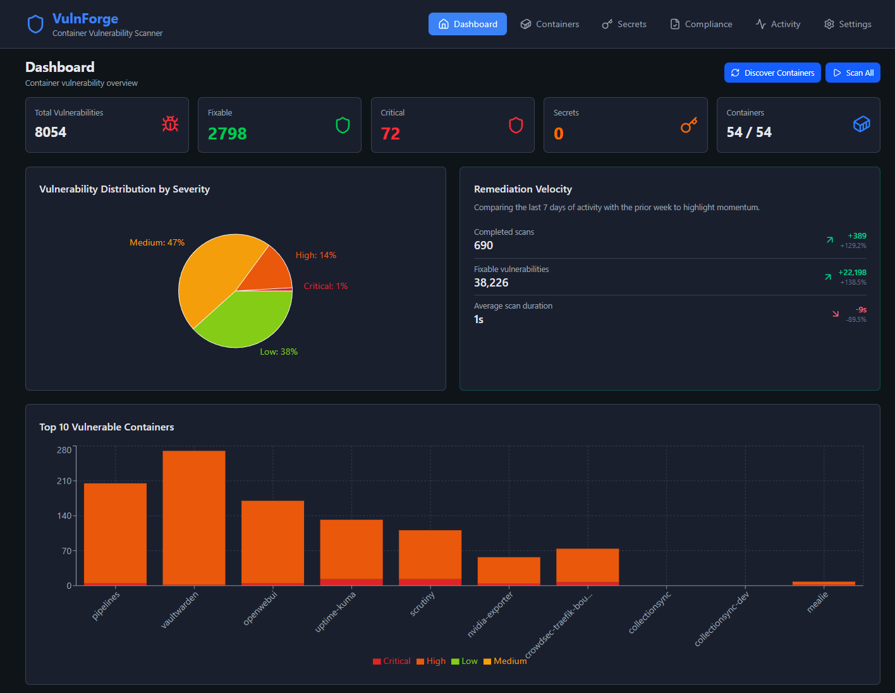

Container Security Insights for Your Homelab

---

---

## Key Features

- **Vulnerability Scanning** - Trivy integration with KEV tagging, CVSS scoring, and comprehensive history
- **Compliance Monitoring** - Native CIS compliance checks with weekly reporting
- **Image Efficiency Analysis** - Dive layer analysis for optimization insights
- **Secret Detection** - Scan for exposed credentials with false-positive triage
- **Real-time Progress** - SSE-powered scan status updates
- **7 Notification Services** - Gotify, Pushover, Slack, Discord, Telegram, Email, ntfy
- **Activity Logging** - Complete audit trail of all operations
- **Database Encryption** - AES-128 encryption for sensitive fields
- **Light/Dark Theme** - Automatic system preference detection
- **Self-Hosted** - Your data stays on your infrastructure

**Default Mode**: Runs with no authentication for easy setup. Configure authentication in Settings before exposing to the internet.

📖 **[Complete Installation Guide](https://github.com/homelabforge/vulnforge/wiki/Installation)**

## Support

- **📚 Documentation**: [GitHub Wiki](https://github.com/homelabforge/vulnforge/wiki)
- **🌐 Website**: [homelabforge.io/builds/vulnforge](https://homelabforge.io/builds/vulnforge/)
- **🐛 Bug Reports**: [GitHub Issues](https://github.com/homelabforge/vulnforge/issues)
- **💬 Discussions**: [GitHub Discussions](https://github.com/homelabforge/vulnforge/discussions)

---

## License

MIT License - see [LICENSE](LICENSE) file for details.

---

## Acknowledgments

Built for homelabbers who want comprehensive container security insights without relying on third-party services.

Part of the [HomelabForge](https://homelabforge.io) ecosystem.

### Development Assistance

VulnForge was developed through AI-assisted pair programming with **Claude** and **Codex**, combining human vision with AI capabilities for architecture, security patterns, and implementation.
